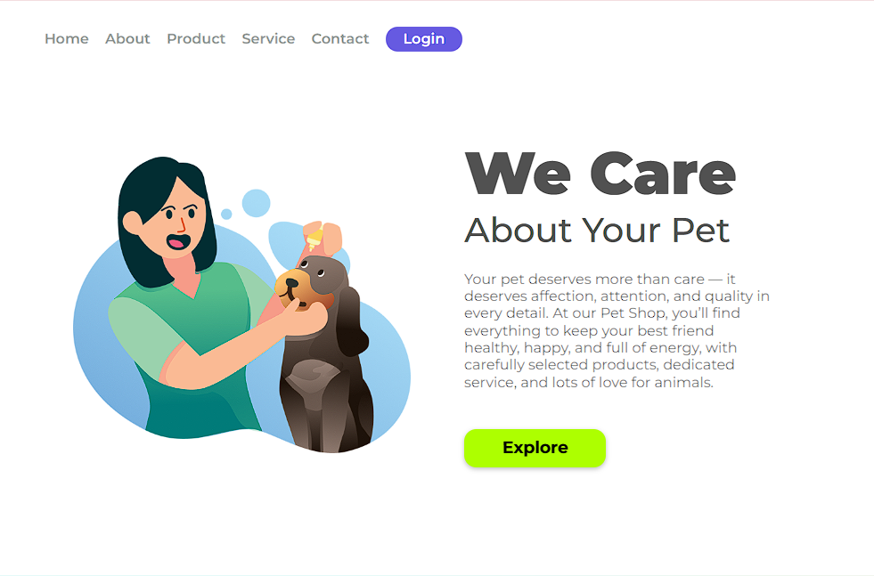

## 🐶 We Care

Uma landing page moderna e responsiva desenvolvida durante a comunidade <a href="https://www.devclub.com.br/">DevClub</a>, com foco em prática de HTML e CSS na construção de interfaces profissionais.

📷 Prévia do Projeto

## 📌 Sobre o Projeto

Este projeto consiste na criação da página inicial de um site de Pet Shop, com layout limpo, tipografia moderna e estrutura organizada.

A proposta foi desenvolver uma interface visualmente agradável, destacando:

- Menu de navegação
- Seção principal
- Texto institucional
- Botão de chamada para ação (CTA)

## 🚀 Tecnologias Utilizadas

  
  
  
  

 ## 🎯 Funcionalidades

- Navegação superior com botão de login

- Seção principal com destaque visual

- Botão "Explore" com efeito visual

- Layout organizado com uso de Flexbox

- Estrutura pronta para expansão futura (JS ou backend)

## 💡 Aprendizados

Durante o desenvolvimento deste projeto, pratiquei:

✔ Estruturação semântica com HTML

✔ Organização de layout com Flexbox

✔ Posicionamento de elementos

✔ Estilização moderna com CSS

✔ Hierarquia visual e contraste

✔ Construção de uma landing page profissional

## 🔥 Próximos Passos

 → Adicionar responsividade mobile mais avançada

 → Implementar interações com JavaScript

 → Criar página de Login funcional

 → Adicionar animações

 ## 👨‍💻 Autor

> Desenvolvido por Ismael Quirino  
> Front-End Developer em formação 🚀
